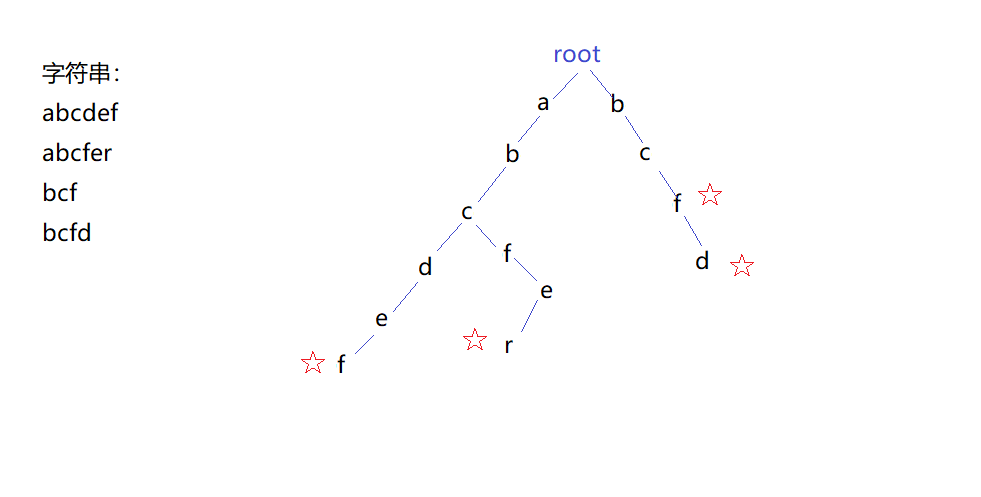
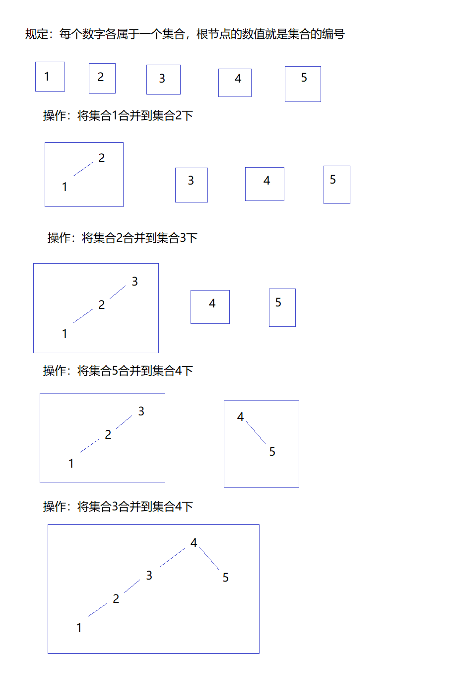
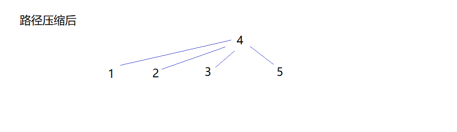
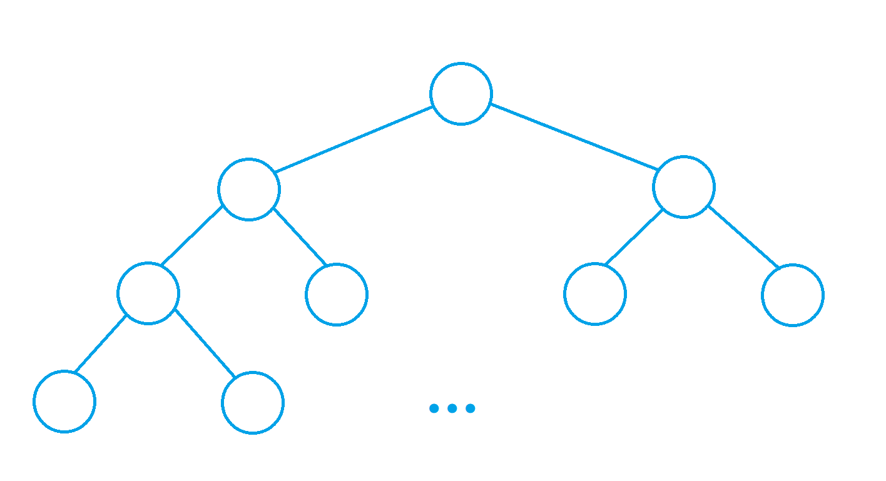

这段时间噬月在进行数据结构和算法的复习和学习！

这篇博客将包括Trie树、并查集以及熟悉的堆。

<!--more-->

本篇算法模板来自AcWing的y总。

## Tire树

当我们想维护一个集合的时候，我们会怎么做呢？如果我们希望维护一个字符串集合，我们又会如何来储存字符串，使得查询动作更加的高效呢？Tire树就是一个不错的选择。

这是一个简单而不失实用性的数据结构，让我们直观观察一下它长什么样：



可以看到，我们在维护的字符串集合里有四个字符串，我们的存储方式十分的明了：创建一棵树来储存这个字符串集合；对于每个字符串，从头开始遍历字符串的每个字符；如果该字符不存在于当前位置，则创建该字符的节点，若存在，则继续遍历下一个字符；循环进行上面的过程，当字符串读取完成后，就在结尾字符上做一个标记，表明在此处是一个字符串的结尾。经过这样的操作后，不难得出上图的结构，这棵树就是我们维护的集合。

这样的结构也便于查找：同样的，从根节点开始，依次向下搜寻要查找的字符串的各个字符是否存在，若不存在，立即跳出并返回`false`；若字符串遍历结束后发现每个字符都存在，那么检查最后一个字符位置是否有标记，若有，返回`true`，否则返回`false`。

我们可以看一个简单的例题：[Trie字符串统计](https://www.acwing.com/problem/content/837/)

```cpp
#include <iostream>
#include <cstdio>

using namespace std;

const int N = 1e5 + 10;
int son[N][26], cnt[N], idx;
// son[p][u]记录节点p的子节点u，因为本题字符只有字母，故有26种情况
// cnt[p]记录集合内以节点p结尾的字符串的个数
// idx作用类似静态链表中的idx，表示当前消耗的数组模拟的堆内存的位置
char str[N];

void insert(char * str) {
    int p = 0;
    // 从根节点开始，根节点是空节点
    for (int i = 0; str[i]; ++ i ) {
        // 技巧：str结尾字符为'\0', '\0' = 0;
        int u = str[i] - 'a';
        // 映射
        if (!son[p][u]) son[p][u] = ++ idx;
        // 判断节点p的子节点u是否存在，不存在则创建
        p = son[p][u];
        // 改变当前节点到子节点
    }
    cnt[p] ++ ;
    // 记录集合内以节点p结尾的字符串的个数
}

int query(char * str) {
    int p = 0;
    for (int i = 0; str[i]; ++ i ) {
        int u = str[i] - 'a';
        if (!son[p][u]) return 0;
        p = son[p][u];
    }
    return cnt[p];
}

int main() {
    int n;
    cin >> n;
    while (n -- ) {
        char op[2];
        scanf("%s%s", op, str);
        if (*op == 'I') insert(str);
        else printf("%d\n", query(str));
    }
    return 0;
}
```

---

## 并查集

并查集乍一听是个晦涩的术语，其实不是如此。并查集完全可以顾名思义：可以支持**快速合并**集合以及**快速查找**某个元素属于哪个集合的数据结构。

什么叫快速？我们不妨先来感受一下慢速：假如我们有从$n$个元素属于$A$集合，$m$个元素属于$B$集合，记录元素的方式是开一个数组，对于每一个元素
$x$，`set[x]`表示其所属集合；那么现在要合并两个集合，就要进行$n$或$m$次操作——我们需要依次改换数组元素的值，时间复杂度是$O(n)$的。而在这种情况下我们要想查找某个元素属于哪一个集合则会较为简单，只需要一次访问即可。

而并查集，无论是合并集合还是查找元素，时间复杂度都达到了惊人的*接近于$O(1)$*。它是怎么做到的呢？其实并不难，关键在于用树储存数据以及及时的优化，。并查集的树储存（在优化之前）并没有什么特定的规则，我们可以通过模拟并查集的合并操作来观察并查集的树形结构是怎么形成的。



上图展示的是并查集在合并集合时的操作，可见并查集的树形结构是通过合并的过程逐步形成的，而不是类似（接下来会复习到的）堆或其他树一样有一个特殊的构造方法。而并查集合并两个集合只需要一次操作，因而时间复杂度是$O(1)$。而在并查集中查询某个元素属于哪个集合也很简单，你只需要不断沿着父节点往上寻找，直到找到树根，树根的节点值即是该元素所属的集合编号。你也许会说：这样的查询方式效率显然没有之前高呀，之前的查询是$O(1)$，而现在的树形结构显然在$O(\log n)$和$O(n)$之间。

没错，因此我们要对并查集进行优化，而优化的思路就是让合并集合产生的树尽量的矮。我们一般有如下两个做法：

1. 路径压缩
    令父节点不指向根节点的节点的父节点指向根节点，以便之后进行$O(1)$的访问。是很强的优化。
2. 按秩优化
    当合并两棵高度不同的树时，优先考虑把矮树的根节点插入到高树的根节点下面，使得合并后的树更矮。（个人觉得和路径压缩比起来确实没什么卵用）。

按秩优化似乎也可以使得路径压缩所需的操作次数更少，但由于收效不大，接下来的代码实现只使用路径压缩。而使用路径压缩之后的并查集，查询操作的时间复杂度就可以达到所谓的接近$O(1)$了（说接近而不说等于，是因为路径压缩的耗时应当算入查询耗时当中，详见下面的实现）。



同样我们可以看一下AcWing的例题[合并集合](https://www.acwing.com/problem/content/838/)

```cpp
#include <iostream>
#include <cstdio>

using namespace std;

const int N = 1e5 + 10;
int p[N];

int find_root(int x) { // 很妙地同时进行了路径压缩
    if (p[x] != x) p[x] = find_root(p[x]);
    return p[x];
    // 这里不能写成返回x，否则当中途改换了p[x]时，
    // 便只有最后一层递归可以保证返回正确值
}

int main() {
    int n, m;
    cin >> n >> m;
    for (int i = 1; i <= n; ++ i ) {
        p[i] = i;
    }

    while (m -- ) {
        char op[2];
        int a, b;

        scanf("%s%d%d", op, &a, & b);

        if (*op == 'M') p[find_root(a)] = find_root(b);
        else {
            if (find_root(a) == find_root(b)) printf("Yes\n");
            else printf("No\n");
        }
    }
    return 0;
}
```

以上是并查集的基础内容。

---

模板题的并查集用法当然是比较简单的情况，实际应用场景可能更加复杂一些，这时我们就需要考虑在使用并查集的同时维护一些额外的信息。比较简单的例子是我们需要记录每个集合的元素数量，要达到这个目的我们只需要初始化每个集合的元素数量为1，并在合并集合的同时合并元素数量即可。而更加复杂的情况下，我们可能要使用**带权并查集**。

### 带权并查集

典例：[食物链](https://www.acwing.com/problem/content/242/)

```cpp
#include <iostream>
#include <cstdio>

using namespace std;

const int N = 5e5 + 10;
int p[N], d[N], cnt;

int find(int x) {
    if (p[x] != x) {
        int t = find(p[x]);
        d[x] += d[p[x]];
        // Updata the distance from previous node first.
        // If we compress the path first, the previous node will
        // change to the root node, which will lead to a wrong return
        // of d[p[x]].
        p[x] = t;
    }

    return p[x];
}

int main() {
    int n, k;
    cin >> n >> k;
    for (int i = 1; i <= n; ++ i ) {
        p[i] = i;
    }

    while (k -- ) {
        int op, x, y;
        scanf("%d%d%d", &op, &x, &y);

        if (x > n || y > n) {
            cnt ++ ;
            continue;
        }

        int root_x = find(x);
        int root_y = find(y);

        if (op == 1) {
            if (root_x == root_y) {
                if ((d[x] - d[y]) % 3) cnt ++ ;
            }
            else {
                p[root_x] = root_y;
                d[root_x] = d[y] - d[x];
            }
        }
        else {
            if (root_x == root_y) {
                if ((d[x] - d[y] - 1) % 3) cnt ++ ;
            }
            else {
                p[root_x] = root_y;
                d[root_x] = d[y] + 1 - d[x];
            }
        }
    }

    cout << cnt << endl;

    return 0;
}
```

---

## 堆

*我曾经在洛谷撞南墙的时候为了解一道题而学习了堆排序，手写了大根堆和小根堆的模板，虽然过程曲折，并且知道stl有自带优先队列后捶胸顿足，但仍觉得早点学习堆是个好事——这玩意着实有点漂亮。*

堆同样是一种数据结构——也许我们一开始可能把堆栈和堆内存栈内存搞混，但实际上它们还是不同的东西，有必要说明一下。在上一篇数据结构的博客里，我们已经讨论过那个简单到令人发指的栈，接下来我们会讨论相对复杂一点的堆。

---

stl中存在的堆叫做**优先队列**（*priority_queue*），如果你已经提前知道了优先队列的概念，那么直观的印象应该不难形成；如果不知道，那么我们可以考虑这样的一个队列：*入队依然从队尾入队，而出队不再是简单地从队头取出，而是根据元素的某种优先级来取*。有这样性质的队列就称为优先队列。

那么优先队列和堆又有什么关系呢？我个人的理解是：优先队列可以使用堆来实现；或者你也可以说：优先队列就是堆，二者等价，我觉得也无可厚非。

OK，暂且抛开优先队列的实现不讲，我们来感受一下堆能干什么。现在我们假定优先级是数的大小，数值越大，优先级越高；这样我们把不同的数插入堆中，取数时便可以从最大的数开始取，依次取到最小的数。这样我们就可以得到一列降序的数——这便是**堆排序**的基本思想（若要得到升序，则使得数值越小的数优先级越大即可）。

那么这种按照优先级大小依次取数的操作，堆是如何实现的呢？我们首先要了解堆的结构：堆是一棵[完全二叉树](https://baike.baidu.com/item/%E5%AE%8C%E5%85%A8%E4%BA%8C%E5%8F%89%E6%A0%91)。



我们插入数的时候，按照从上到下，从左到右的顺序填充这棵树；而取数时，则只取根节点。当我们需要弹出根节点时，*根据优先级对树的节点进行调整，保证根节点永远是优先级最大的节点*。由于这个根节点的性质，我们也将上述两周堆排序使用到的堆分别称为**大根堆**和**小根堆**。

我们可以看出来，为保证根节点的优先级最大，调整的过程是关键。在此，我以小根堆插入新元素以及弹出根节点元素两种情况为例，演示一下调整的过程。

插入新元素时：

1. 在堆末（按照从上到下，从左到右的顺序）加入新元素，并设置为当前节点。
2. 当当前节点不是根节点，且当前节点小于父节点时，交换两个节点，并将父节点设置为当前节点。
3. 递归执行第二步。

可以想见，经过这样的操作，堆顶元素（或称为树根节点）必定是最小的一个。

弹出根节点时：

1. 取出根节点。
2. 比较空节点的两个子节点，将较小的节点放到父节点上。
3. 对于每个被取到父节点的子节点，递归执行第二步，直到不再有子节点。

可以想见，经过这样的操作，堆顶元素（或称为树根节点）必定是最小的一个，且弹出根节点之后的堆依然保持着完全二叉树的形态。

*注：在代码实现弹出根节点时，我们一般使用堆的末尾元素来覆盖头节点元素，并重新调整覆盖后头节点元素的位置，这样规避了空节点的情况，处理起来更加方便。*

---

代码实现时，我们会考虑使用数组来模拟完全二叉树。对于任何一个完全二叉树的节点$k(k > 1)$，它的左儿子编号是$k \times 2$，右儿子编号是$k \times 2 + 1$，这是很容易证明的，并且恰好很适合使用数组来实现。

而上述两个操作例子也可以进一步分解成两个操作：`up`和`down`的组合。

接下来以AcWing的一题[模拟堆](https://www.acwing.com/problem/content/841/)为例，观察具体的代码实现：

```cpp
#include <iostream>
#include <cstdio>
#include <cstring>

using namespace std;

const int N = 1e5 + 10;
int h[N], idx;
int kh[N], hk[N];

void hswap(int x, int y) {
    swap(h[x], h[y]);
    swap(kh[hk[x]], kh[hk[y]]);
    swap(hk[x], hk[y]);
}

void down(int x) {
    int t = x;
    if (x * 2 <= idx && h[x * 2] < h[t]) t = x * 2;
    if (x * 2 + 1 <= idx && h[x * 2 + 1] < h[t]) t = x * 2 + 1;

    if (t != x) {
        hswap(x, t);
        down(t);
    }
}

void up(int x) {
    while (x / 2 && h[x / 2] > h[x]) {
        hswap(x / 2, x);
        x >>= 1;
    }
}

int main() {
    int n;
    cin >> n;
    int k = 1;
    while (n -- ) {
        char op[5];
        scanf("%s", op);

        if (!strcmp(op, "I")) {
            int x;
            scanf("%d", &x);
            h[++ idx] = x;

            hk[idx] = k;
            kh[k] = idx;
            ++ k;

        up(idx);
        }
        else if (!strcmp(op, "PM")) {
            printf("%d\n", h[1]);
        }
        else if (!strcmp(op, "DM")) {
            hswap(1, idx);
            idx --;
            down(1);
        }
        else if (!strcmp(op, "D")) {
            int kk;
            scanf("%d", &kk);

            kk = kh[kk];

            hswap(kk, idx);
            idx --;


            up(kk);
            down(kk);
        }
        else if (!strcmp(op, "C")) {
            int kk, x;
            scanf("%d%d", &kk, &x);

            h[kh[kk]] = x;

            up(kh[kk]);
            down(kh[kk]);
        }

    }
    return 0;
}
```
